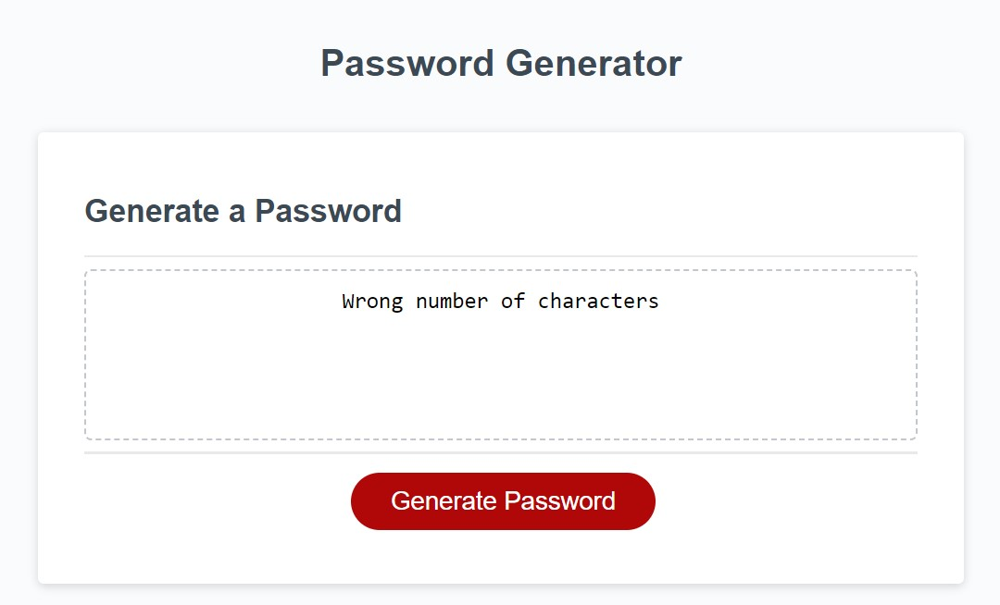
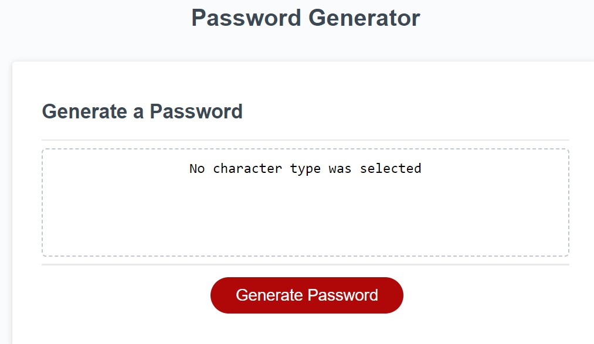

# Password-Generator

Application that generates a random password based on criteria.

# Description

This web application generates passwords using uppercase, lowercase, special and numeric characters, based on unser's input.

# Instalation

The Password Generator website page can be accessed [here](https://ionescuea.github.io/Password-Generator/).

# Usage

The webpage generates uniques passwords for the user.

On the main page, click 'Generate Password'.

A prompt will appear asking to chose a number of characters between 8 and 128, as that's how long the password will be.

If the user is selecting a number outside the 8 to 128 range, a message will appear on the sceen (instead of the password).

Next, a series of 'confirm' options will appear, as the user will be asked to chose between lowercase, uppercase, numeric and special characters. Also, there is the option to press 'cancel' and that character type will not be included in the password.

If no character is selected, a message will appear on the screen (instead of the password).

Once all the questions, promp and confirm, were responded, the password will appear on the screen.

# Credits

[BootcampSpot](https://github.com/edx)

[Alexandra Ionescu](https://github.com/ionescuea)

# License

Licensed under the [MIT](LICENSE) license.
